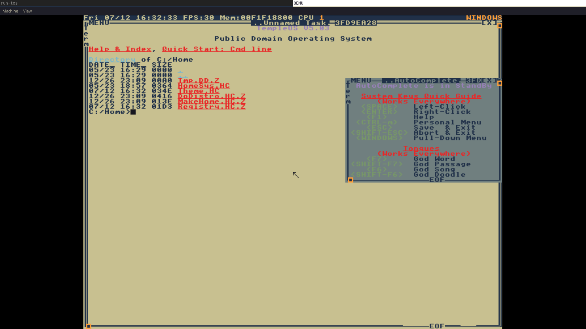

# [TempleOS](http://templeos.org/) - Place for learning Holy C



*For how to get the same color theme see [./Home/Theme.HC](./Home/Theme.HC)*

## Copyright & Inspiration

All the Copyrights for the scripts and theme management were made by [Alexey Kutepov](https://gitlab.com/tsoding/aoc-2021/-/tree/master?ref_type=heads). 
You can find his playlist describing the journey of coding in TempleOS [here](https://www.youtube.com/playlist?list=PLpM-Dvs8t0VZNUvTX1pqfpI_tMkhWCLYL). 

## Quick Start

### Dependencies

- [QEMU](https://www.qemu.org/)
- [rsync](https://rsync.samba.org/)

### Configuration

All of the scripts use configuration from `config.sh` script. Open it and customize it to your liking. (I'd recommend to actually not, but who am I to tell you what to do?)

### TempleOS Installation

```console
$ ./install.sh TOS.img
... Follow the Installer instructions, but don't reboot at the end. Just close the VM ...
$ ./sync.sh temple ./TOS.img
```

### Running

```console
$ ./run.sh ./TOS.img
... Boot the C drive ...
```

### Mounting the File System

```console
$ ./mount.sh ./TOS.img
$ cd ./mnt/
```

You can run `./mount.sh` script several times, it unmounts the image before trying to mount it again. Also the `run.sh` also unmounts the image before running the VM. You usually never have to unmount it manually, but if you need to you can always do `sudo umount ./mnt/`.

### Sync the Home between the Host and the Temple

The subcommand (`temple` or `host`) basically denotes the target.

#### From Host to Temple

```console
$ ./sync.sh temple ./TOS.img
```

#### From Temple to Host

```console
$ ./sync.sh host ./TOS.img
```
